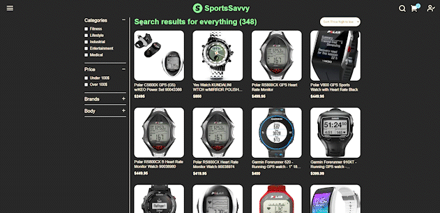

# SportsSavvy | 🏀 E-commerce for Sports Technologies - Team project

## Trailer

## Description

An innovative e-commerce website developed by a team of 4 tech-savvy developers. Explore and shop for the latest tech products in the sports industry, with a user-friendly interface and a seamless shopping experience.

## Problems and Challenges

- Working in a team using GitHub for the first time presented a significant challenge. Coordinating and merging individual contributions while ensuring consistency and avoiding merge conflicts required constant communication and collaboration with my teammates.
- Another challenge was building both the frontend and the backend from scratch. Since we only had access to the data, we had to export it to MongoDB and design the UI and API based on the data. This required a deep understanding of the technology stack and meticulous attention to detail.
- Completing the project within a week was a particularly tight timeline, given the complexity of the features we wanted to implement. This required efficient task management, rapid decision-making, and creative problem-solving to overcome any obstacles that arose during the development process.

## Solutions

- Completed the Figma plan and Trello planning of the application, laying out the structure of the site and organizing the tasks.
- Worked as the only full-stack developer on the team, providing support to other members when needed and ensuring that everything was working seamlessly.
- In charge of Git verification, verifying the work of other team members to avoid conflicts and ensure that the project was on track.
- Implemented a filtering and sorting feature, allowing users to sort products by brand, price, and company.

## Project Details

- Development time: Completed in 1 week
- Frontend: Developed using React, JavaScript, and Styled-components, which provided a smooth and responsive user interface that enhanced the shopping experience.
- Backend: Developed using Node.js, Express, and MongoDB, which allowed for seamless data management and efficient API calls.
- Tools: Utilized Figma for planning and designing the UI, Trello for task management, and GitHub for version control and collaboration.

## Conclusion

Overall, the SportsSavvy project was a challenging but highly rewarding experience. Working in a team with GitHub for the first time presented a significant challenge, but the collaboration and communication with my teammates were crucial in delivering a high-quality e-commerce website. I was able to contribute significantly to the project by completing the Figma plan and Trello planning, ensuring everything was working seamlessly, and helping teammates debug their code. Being the only full-stack developer in the team, I was responsible for implementing features such as filtering and sorting of products, as well as verifying code using Git.

In terms of technology, I worked with React, JavaScript, and Styled-components for the frontend and Node.js, Express, and MongoDB for the backend. The project development time was tight, with only one week to deliver a functional e-commerce website. Despite these challenges, we were able to deliver a product that met the project requirements and demonstrated our skills in web development. I learned a lot from this project and gained valuable experience in working in a team, using GitHub, and building a full-stack web application.